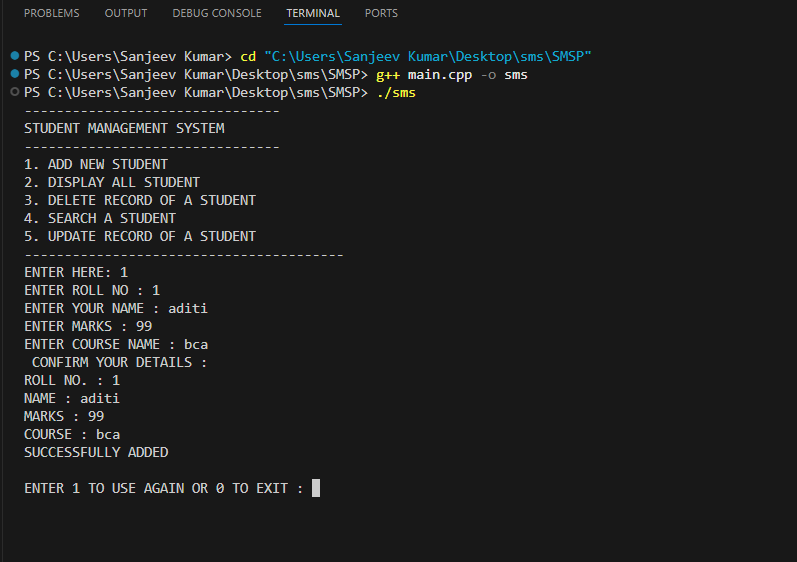

# SMSP

Student Management System Project.

A C++ console-based project for managing student records using file handling — add, view, search, update, and delete student data efficiently.

#### OVERVIEW:

The Student Management System is a menu-driven C++ project demonstrating the use of classes, objects, and file handling for persistent data storage. 
It’s designed to simulate how basic database operations (CRUD) work internally in C++.

##### FEATURES:

- ➕ Add new student records  
- 📋 Display all student data  
- 🔍 Search for a student by roll number  
- 🗑️ Delete a specific student record  
- ✏️ Update existing student information  
- 💾 Persistent storage using file handling (`data.txt`)

###### TECHNOLOGIES USED:
Language: C++

IDE: Visual Studio Code

Version Control: Git & GitHub

File Handling: fstream library

###### FILE STRUCTURE:

```plaintext
┌── SMSP/
│
├── main.cpp        # Main source code file
├── data.txt        # Stores student records (created automatically after running)
├── README.md       # Project documentation
└── sample-run.png  # (optional) Screenshot of sample program output
└───────────────────────────────────────────────


#### HOW TO RUN:

1. Clone the repository

git clone https://github.com/Aditi-Sharma13/SMSP.git


2. Open the folder in VS Code or any C++ IDE


3. Compile and run:

g++ main.cpp -o main
./main


4. Follow the on-screen menu options

#### SAMPLE RUN (SCREENSHOT) :



#### AUTHOR:
Aditi Sharma
🚀 BCA Student | C++ Learner | Passionate about building projects with file handling & logic .
📬Connect with me on [LinkedIn](www.linkedin.com/in/aditi-sharma-bca13)
